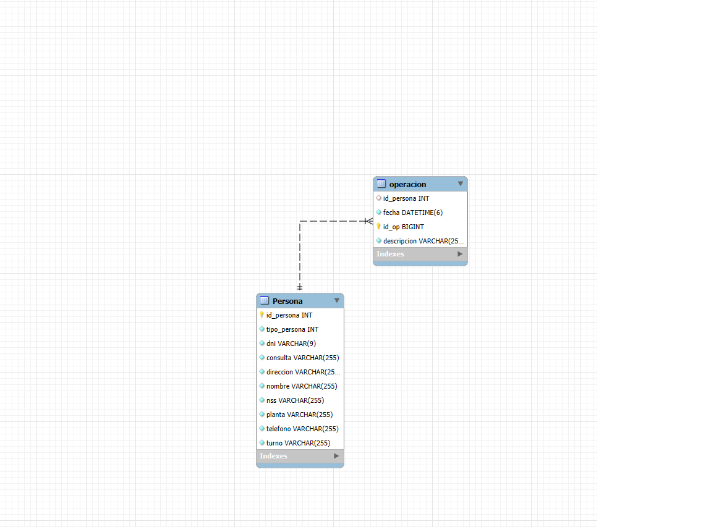
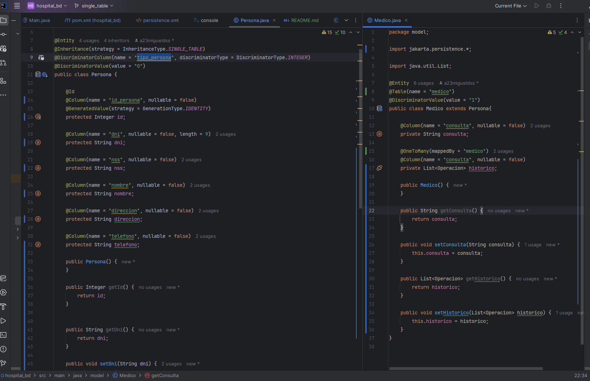
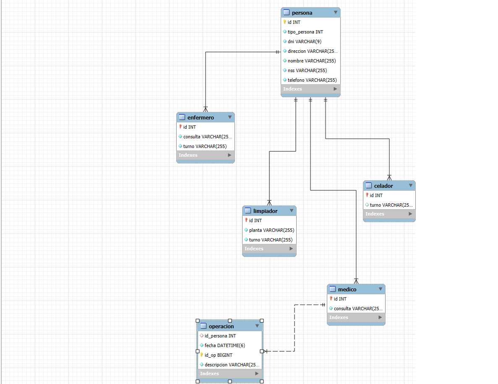
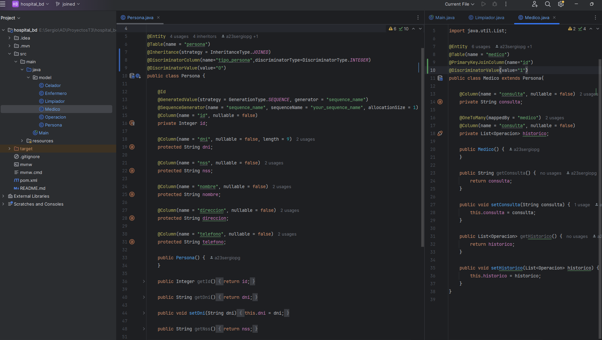
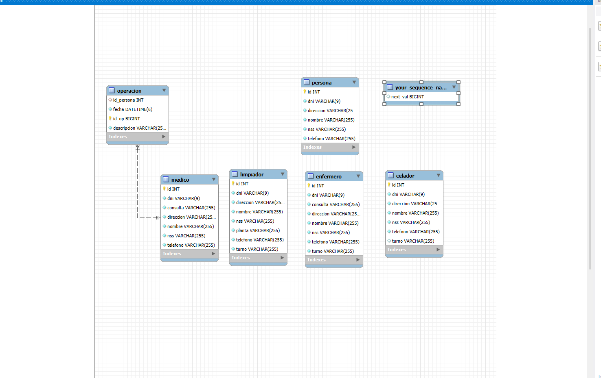
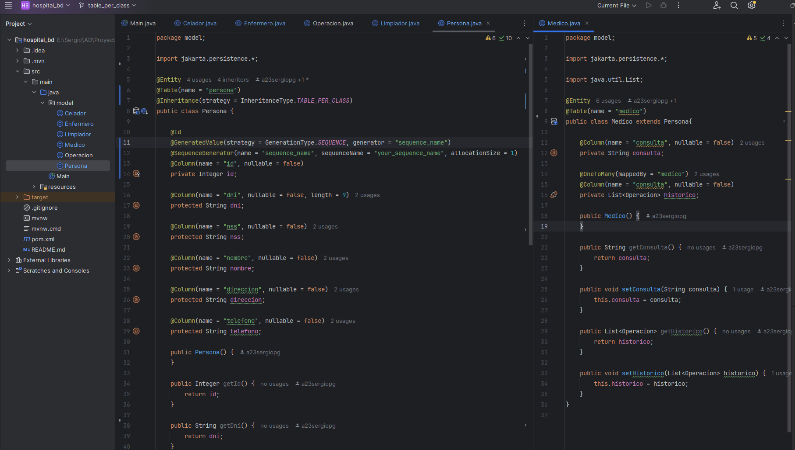

## Ejercicio 3.3 Acceso a datos

### 1. SINGLE TABLE

#### 1.1 Diagrama E-R

#### 1.2 Clases de Java

### 2. JOINED

#### 2.1 Diagrama E-R

#### 2.2 Clases de Java

### 3. TABLE PER CLASS

#### 3.1 Diagrama E-R

#### 3.2 Clases de Java

